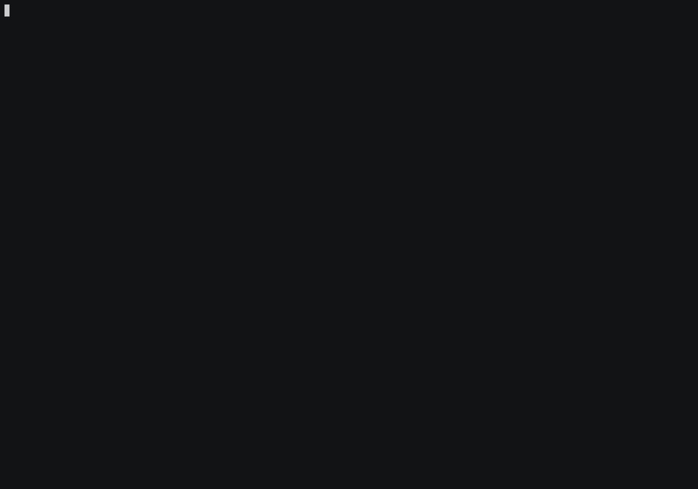

counter
=======

> My counter app. There are many like it; but this one is mine. 



```
gtdtxt v0.2.0 (semver.org)
Alberto Leal <mailforalberto@gmail.com> (github.com/dashed)
Countdown or countup program

USAGE:
    counter [FLAGS] [OPTIONS] [ARGS]

FLAGS:
    -u, --count-up    Count up.
    -h, --help        Prints help information
    -V, --version     Prints version information

OPTIONS:
    -n, --note <note>    Attached note.

ARGS:
    [time-length]    Time length.

```

License
=======

MIT.
